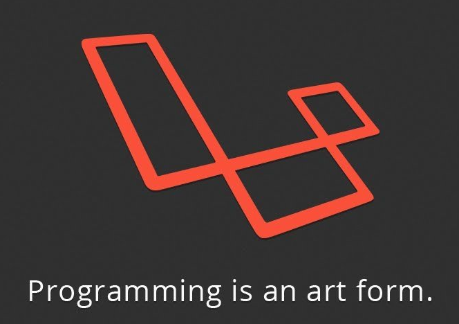

# Phil616 个人博客
## 简介
1. 构建博客

2. 使用bat来激活Typora

```
echo off
set postTitle=%1
set currentDaytime=%time:~0,2%H%time:~3,2%M%time:~6,2%S
rem check if post name is provided
if "%1"=="" (
    echo need a argument as post title, using ctime as defalut
    set postTitle=%currentDaytime%
)


set currentDate=%date:~0,4%-%date:~5,2%-%date:~8,2%
set postFileName=%currentDate%-%postTitle%.md
echo %postFileName%
rem use jekyll compose to create a post
call bundle exec jekyll compose %postTitle%
rem get pwd
set currentDirectory=%cd%

rem get typora path
rem ###############################################################
rem ########### CHANGE THIS PATH TO YOUR OWN EDITOR PATH ##########
rem ###############################################################
set typoraPath="C:\Program Files\Typora\Typora.exe"


if not exist %typoraPath% (
    echo Typora not exist, no editor will be opened
    exit /b 1
)
rem get full path
set postFilePath=%currentDirectory%\_posts\%postFileName%

rem open blog by typora
start "" %typoraPath% %postFilePath%
exit /b 1
```

3. 测试
```
bundle install
bundle exec jekyll s
```

4. 部署
```
git push
```
## 头部信息

```yaml
---
layout: post
title: Root
description: 博客的Root信息
categories: [Blog, Documents]
tags: [static]
date: 2024-08-01 23:06 +0800 
---
```

## 预期项目

### 1. Blog博客 (blog)

1. 技术博客
2. 杂谈
3. 链接其他网站
 - [ ] 重定向博客站
 - [ ] 资源站 


### 2. 网安 (cybersecurity)

1. 1401网络安全学


### 3. 绿荫学院培训 (greenshadeacademy)


## 测试

### 图片测试



### 代码测试

```c
#include <stdio.h>
int main(){}
```

### 文字测试

Test

