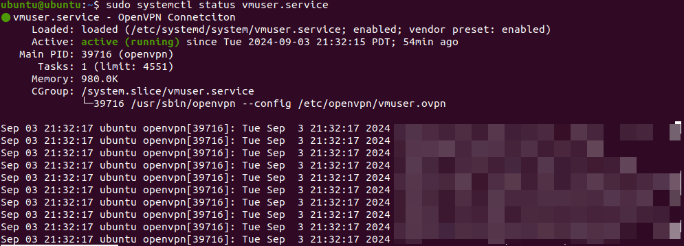

> AUTOGEN b2f50fe4e24244279d1b07a3f42e098a

# Linux下使用OpenVPN连接服务器

1. 安装OpenVPN

   ```bash
   sudo apt update
   sudo apt install openvpn
   ```

2. 获取ovpn配置文件

   ```
   scp user@server:config.ovpn /etc/openvpn
   ```

## 直接连接

```bash
sudo openvpn --config /etc/openvpn/vmuser.ovpn
```

## 自动连接

创建服务单元

```
sudo vim /etc/systemd/system/vmuser.service
```

使用service

```
[Unit]
Description=OpenVPN connection for vmuser

[Service]
Type=simple
ExecStart=/usr/sbin/openvpn --config /etc/openvpn/vmuser.ovpn
Restart=on-failure

[Install]
WantedBy=multi-user.target
```

启用服务

```
sudo systemctl enable vmuser.service
sudo systemctl start vmuser.service
```

停止服务

```
sudo systemctl stop vmuser.service
```


