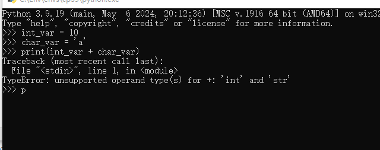
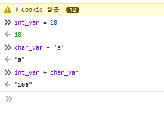
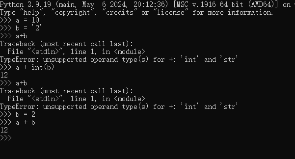

> AUTOGEN c4df385010754f738ba97726d0c27968

# 编程语言的变量类型

一般有如下四种分类方式

### 强类型（Strongly Typed）

强类型指的是在程序中，任何对象或变量所从属的类型都必须在编译时刻确定，且在程序的运行过程中这个变量只能存储这个类型的数据。强类型语言要求变量的使用要严格符合定义，所有变量都必须先定义后使用，且类型一旦确定，就不能随意改变。常见的强类型语言有Java、C++、C#等。强类型语言倾向于不支持类型的隐式转换，这有助于保证类型安全，减少因类型不匹配导致的错误。

### 弱类型（Weakly Typed）

弱类型语言则相对宽松，允许变量在运行时自动改变类型，或者可以在不同类型之间自由进行操作和转换。在弱类型语言中，一个变量的类型是由其应用上下文确定的，而不是在编译时固定下来的。常见的弱类型语言有JavaScript等。弱类型语言可能会允许隐式类型转换，从而提供了更高的灵活性，但也可能增加类型错误的风险。

### 动态类型（Dynamic Typing）

动态类型指的是在运行时确定变量的数据类型。在动态类型语言中，变量的数据类型是根据其赋值的内容动态确定的，而不是在声明时指定的。Python就是一种典型的动态类型语言。在Python中，你可以直接给变量赋值，而无需显式声明其类型；解释器会根据赋值的内容自动为变量分配相应的数据类型。动态类型语言提供了更高的灵活性和简洁性，但也可能需要开发者在运行时进行更多的类型检查和错误处理。

### 静态类型（Static Typing）

静态类型则是指在编译时确定变量的数据类型。在静态类型语言中，变量在使用之前必须声明其类型，并且在整个程序运行期间，这个类型都是固定不变的。常见的静态类型语言有C、C++、Java等。静态类型语言在编译时会进行类型检查，有助于提前发现类型错误，提高程序的可靠性和稳定性。然而，静态类型语言也可能因为类型系统的复杂性而增加编程的难度。

## Python的强类型-动态类型

Python的对象类型在生命周期中是不可变的，考虑如下代码

```python
int_var = 10
char_var = 'a'
print(int_var + char_var)
```

对于强类型语言来说，10 + a这种操作无法进行转换，但弱类型允许这种转换



但

弱类型语言会自动进行类型切换（隐式类型转换）



但Python并不是静态类型语言，因为其所有变量都是引用变量，因此属于动态类型语言，因为下面的操作是允许的。



在上述例子中，b变量是字符串，无法进行加减，显式类型转换可以进行运算，但其引用类型依然是 字符串。

但在b引用了一个新的int类型的对象后，字面值2，则运算可行。

而在静态类型中，一旦变量类型确定，则无法更改，只能通过显式类型转换强制更改。
