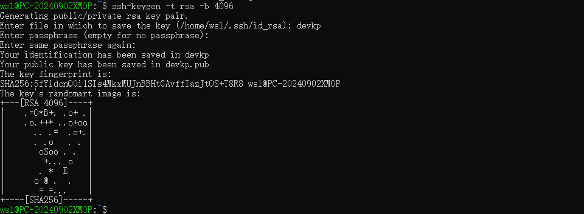

> AUTOGEN 68882dee0af744ecaf96db44f30cefe6

# 在Windows中使用WSL2来使用Linux

# 简介

WSL2（Windows Subsystem for Linux 2）是微软推出的一项功能，它允许用户在Windows 10和Windows 11操作系统上运行Linux环境，而无需使用传统的虚拟机或双启动设置。WSL2是WSL（Windows Subsystem for Linux）的升级版，它通过在轻量级虚拟机中运行真正的Linux内核来提供更好的文件系统性能和完全的系统调用兼容性。

WSL2的主要特点包括：

1. 使用真实的Linux内核，提供了更完整的Linux系统功能支持。
2. 改进的文件系统性能，相比WSL1有显著提升。
3. 支持运行Docker等需要完整Linux内核支持的应用。
4. 支持systemd和Linux GUI应用程序。
5. 允许用户在Windows和Linux之间无缝集成和共享文件。

安装WSL2通常需要以下步骤：

1. 确保Windows 10或Windows 11系统更新到支持WSL2的版本。
2. 在Windows功能中启用“适用于Linux的Windows子系统”和“虚拟机平台”。
3. 从Microsoft Store安装WSL2或使用命令行工具安装。
4. 安装Linux发行版，如Ubuntu、Debian等。

## WSL1与WSL2

| 功能                                           | WSL 1 | WSL 2 |
| ---------------------------------------------- | ----- | ----- |
| Windows 和 Linux 之间的集成                    | ✅     | ✅     |
| 启动时间短                                     | ✅     | ✅     |
| 与传统虚拟机相比，占用资源少                   | ✅     | ✅     |
| 可以与当前版本的 VMware 和 VirtualBox 一起运行 | ✅     | ✅     |
| 托管 VM                                        | ❌     | ✅     |
| 完整的 Linux 内核                              | ❌     | ✅     |
| 完全的系统调用兼容性                           | ❌     | ✅     |
| 跨 OS 文件系统的性能                           | ✅     | ❌     |
| systemd 支持                                   | ❌     | ✅     |
| IPv6 支持                                      | ✅     | ✅     |

## 更新

WSL本身作为一款软件也需要更新：

https://github.com/microsoft/WSL/releases

在Github页面中查看更新

# 安装

## WSL2安装Ubuntu

### 0. 检查系统是否支持

系统需要满足

* Windows 10
* 支持Hyper-V
* 

### 1. 启用WSL功能

在带有Administrator权限的PowerShell中运行

```bash
dism.exe /online /enable-feature /featurename:Microsoft-Windows-Subsystem-Linux /all /norestart
```

来启动WSL，确保网络畅通

### 2. 启用虚拟机功能

```bash
dism.exe /online /enable-feature /featurename:VirtualMachinePlatform /all /norestart
```

### 3. 使用WSL2为默认版本

默认版本为WSL1，需要更改版本为2

```bash
wsl --set-default-version 2
```


### 4. 安装

**此时需要重启系统来应用更改**

可以选择从Microsoft Store或手动下载安装

在Micorsoft Store中搜索ubuntu或是其他版本直接安装

若应用商店不可用，可直接下载AppxBundle文件

https://aka.ms/wslubuntu2004


打开Bundle后会自动安装

若出现错误，可以使用命令行直接输入`ubuntu`来启用ubuntu的安装程序。

随后要求输入UNIX username作为默认的username，除root不允许外可以任意

随后输入密码表示安装完成


### 5. 检查Linux系统

检查系统名称等

```
uname -a
lsb_release -a
cat /etc/os-release
hostname
```


检查网络


WSL2默认使用NAT模式，你可以通过`ifconfig`或`ip addr`命令在WSL2中查看分配给WSL2的虚拟网络适配器的IP地址。

## 使用本地开发

### 1. 构建SSH-Server

启动SSH


在`/etc/ssh/sshd_config`中打开22端口，


启用ssh的密码登录


使用ssh登录


使用密钥对key进行登录

1. 登录服务器

2. 使用命令生成密钥对

   ```bash
   ssh-keygen -t rsa -b 4096
   ```




可看到密钥对

将pub复制到`.ssh/authorized_keys`如果没有，需要在配置文件中启用


运行`(你的密钥对名称).pub >> ~/.ssh/authorized_keys`

使用`cat (你的密钥对名称)`来查看私钥，复制私钥到Windows的.ssh目录下，也可以直接下载文件或复制文件

本地磁盘被挂载到了`/mnt`目录中，盘符以目录形式挂载。可以直接使用如下命令

```
cp ~/devkp /mnt/c/Users/Astar/.ssh/.
```

以devkp为密钥文件，以Astar为Windows的用户

### 2. 使用本地开发

编辑本地.ssh/config文件

```
Host wsl
    HostName 192.168.157.1
    User wsl
    IdentityFile ~/.ssh/devkp
```

其中HostName为登录的host，User为登录用户，Host wsl为ssh的名称

可直接使用ssh wsl登录系统


在VSCode中安装wsl拓展后，可以直接在Remote中登录，但VSCode是没有WSL2的拓展的


此时登录后，便可在VSCode中直接访问，终端此时也可以直接使用ubuntu终端


### 3. 使用镜像网络

每次重新启动wsl时，都会出现IP飘逸，为了固定IP方便访问，可以使用镜像网络。镜像网络需要满足：

* 运行 Windows 11 22H2 及更高版本的计算机上
* WSL2的版本在2.0.0以上

在用户目录下创建.wslconfig


```
[experimental]
autoMemoryReclaim=gradual  
networkingMode=mirrored
dnsTunneling=true
firewall=true
autoProxy=true
```

重启以开启镜像网络

# 参考文章

https://learn.microsoft.com/zh-cn/windows/wsl/

https://learn.microsoft.com/zh-cn/windows/wsl/tutorials/wsl-vscode

https://zhuanlan.zhihu.com/p/593263088

https://learn.microsoft.com/zh-cn/windows/wsl/compare-versions

https://learn.microsoft.com/zh-cn/windows/wsl/wsl-config
