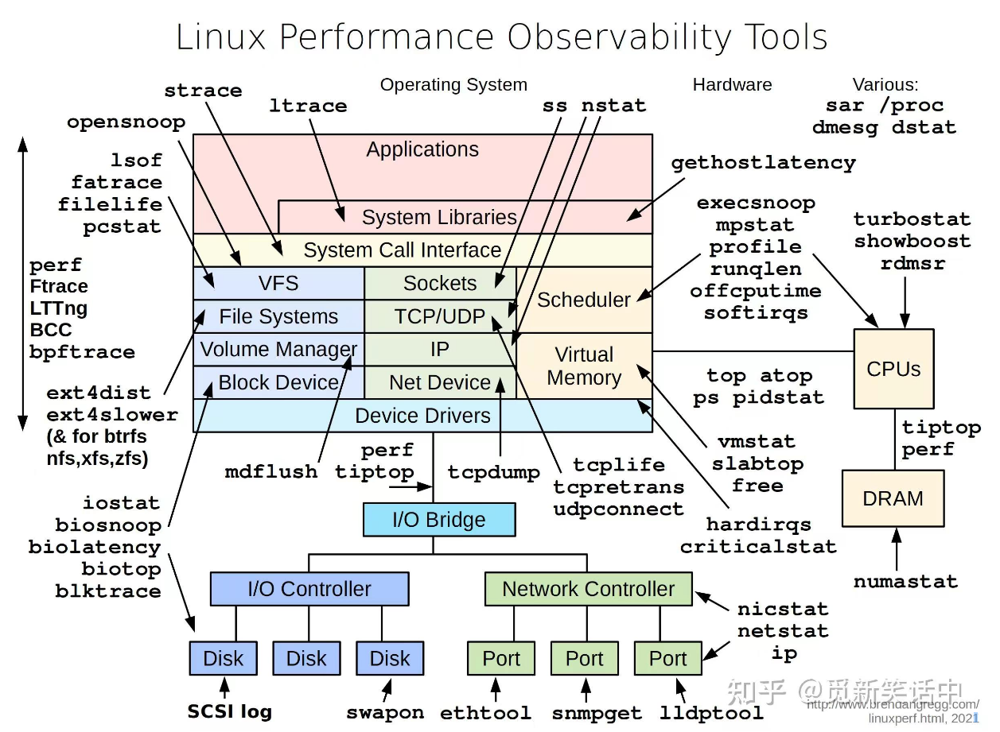

> AUTOGEN a5f0be3b883145509807c308c02859be

# Linux性能观测方法



## 系统组成

1. Applications 应用层
2. System Libraries 系统库
3. System Call Interface 系统调用接口
4. VFS 文件系统
5. File System 文件系统
6. Volume Manager 卷管理器
7. Block Device 块设备
8. Sockets 套接字
9. TCP/UDP 协议
10. IP 网络层
11. Net Device 网络设备
12. Scheduler调度器
13. Virtual Memory 虚拟设备
14. Device Drivers 驱动器驱动

### Applications 应用层

#### ltrace

`ltrace` 是一个在类 Unix 系统（如 Linux 和 FreeBSD）中用于追踪 C 库调用的工具。它主要用于调试程序，可以显示一个程序运行时对库函数的所有调用以及返回值。这对于理解程序的行为，尤其是在没有源代码的情况下，非常有用。

### `ltrace` 的基本使用方法：

1. **安装 ltrace**：
   如果你的系统上还没有安装 `ltrace`，可以通过包管理器来安装它。例如，在 Debian 或 Ubuntu 上，可以使用以下命令：
   ```sh
   sudo apt-get install ltrace
   ```

2. **使用 ltrace 运行程序**：
   使用 `ltrace` 来追踪一个程序的库调用可以通过如下命令：
   ```sh
   ltrace ./your_program
   ```
   这里 `./your_program` 是你要追踪的可执行文件路径。

3. **控制输出**：
   - 可以通过 `-o` 参数将输出重定向到一个文件中：
     ```sh
     ltrace -o output_file ./your_program
     ```
   - 使用 `-i` 参数来指定只追踪某些特定的函数：
     ```sh
     ltrace -i open,close ./your_program
     ```
   - 使用 `-I` 参数来忽略某些特定的函数：
     ```sh
     ltrace -I open,close ./your_program
     ```
   - 使用 `-T` 参数来显示线程ID：
     ```sh
     ltrace -T ./your_program
     ```

4. **其他选项**：
   - `-t` 显示时间戳。
   - `-S` 显示信号处理函数。
   - `-e` 只显示退出（返回）信息。
   - `-s` 不显示进入函数的信息。
   - `-f` 跟踪子进程中的函数调用。
   - `-u` 跟踪未定义符号的函数调用。
   - `-v` 显示版本信息。

5. **注意事项**：
   - `ltrace` 会显著减慢程序的执行速度，因为它是在每次库调用时都进行拦截。
   - 对于非调试目的的使用，`ltrace` 可能会影响程序的性能。

